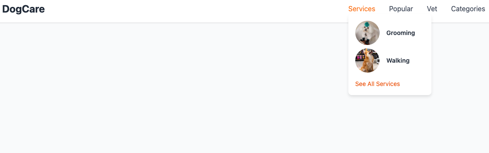

# DogCare Responsive Multi-level Menu

This is a fully responsive, multi-level dropdown menu built with **HTML**, **CSS3**, and **Tailwind CSS** — no JavaScript required. Designed for a dog services website, it features smooth hover and focus interactions for seamless navigation across all platforms and devices.

---

## Features

- Pure CSS multi-level dropdown menus with smooth fade-in/out transitions
- Submenus open on hover and stay open while interacting, thanks to `:hover` + `:focus-within`
- Nested submenus open to the left or right (configurable)
- Responsive layout with Tailwind utility classes
- Accessible with keyboard focus support (`tabindex="0"` on links)
- Visual styling inspired by modern clean UI for pet-related services

---

## Usage

1. Copy the entire HTML structure (including `<head>`, `<style>`, and `<body>`) from the provided example.
2. Paste it into your project’s HTML file where you want the navigation to appear.
3. Make sure Tailwind CSS is loaded by adding this in the `<head>` if not already present:
   ```html
   <script src="https://cdn.tailwindcss.com"></script>
4. Modify menu items, links, and images as needed to suit your content.
5. Adjust submenu directions or styles by editing the CSS inside the <style> tag.
6. Open the page in a modern browser (Chrome, Firefox, Edge, Safari) to see it in action.

Preview


License
MIT © YourNameHere